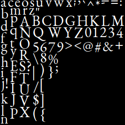
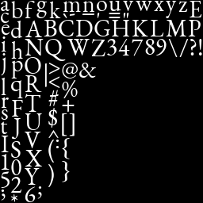

# Font Atlas Generator

A font atlas generator written in Rust using the Rust bindings for [FreeType](https://www.freetype.org/index.html)

## Samples
Some atlas samples.

With Subpixel Rendering:

Without Subpixel Rendering:

## Bugs
It seems that loading characters of certain sizes cause the freetype library to return a "cannot open resource" error. I still don't know why.

## Benchmark

You can run the benchmark to see how long the atlas generation takes. For the two versions it takes around 7ms to generate the full atlas, which is kind of slow for the moment.
